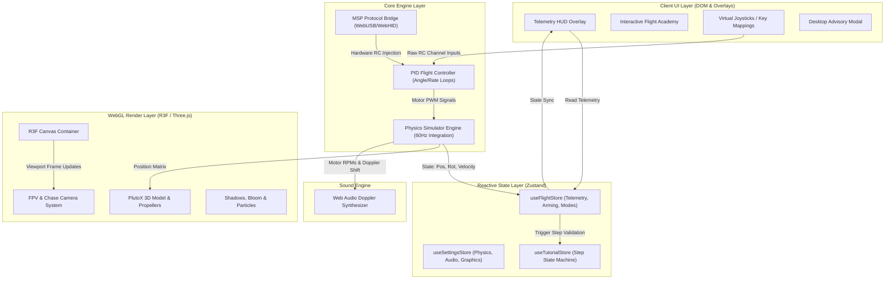
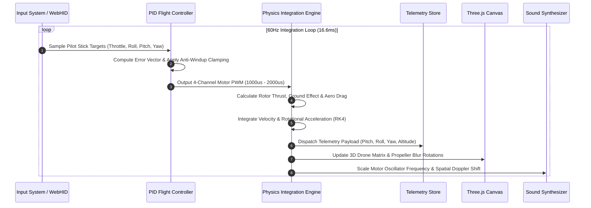
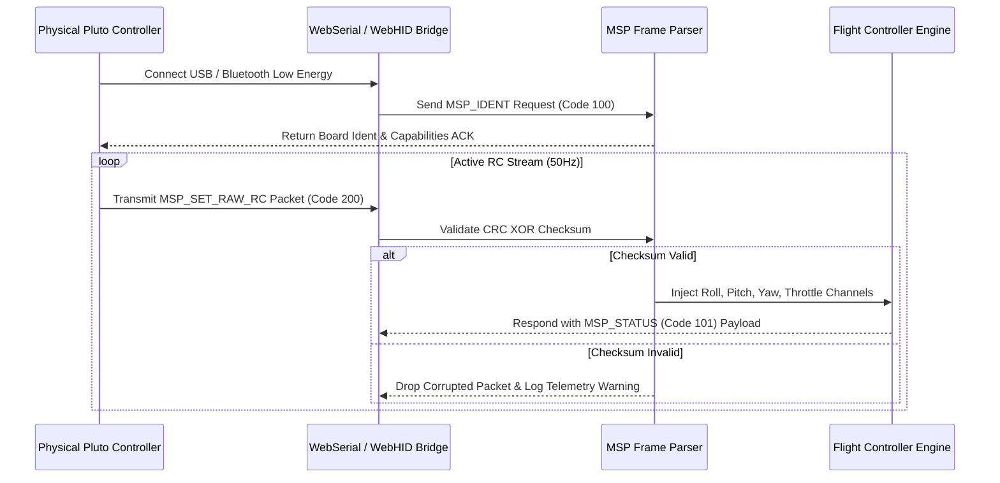
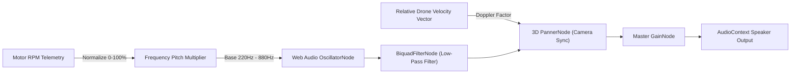

# Drona Aviation PlutoX 3D World Laboratory

[](https://vitejs.dev/)
[](https://react.dev/)
[](https://threejs.org/)
[](https://www.typescriptlang.org/)
[](https://vitest.dev/)
[](https://tailwindcss.com/)
[](https://dronaviation-3d-world.vercel.app)

An industrial-grade, interactive 3D physics simulator and hardware telemetry suite for Drona Aviation's **PlutoX (Primus X2)** nano-quadcopter. Built with modern WebGL (Three.js / React Three Fiber), custom PID flight control dynamics, MultiWii Serial Protocol (MSP) hardware bridge support, Web Audio spatial Doppler synthesis, and automated Vitest validation.

---

## 🏗️ System Architecture & Data Flow

### 1. High-Level Modular Platform Architecture

The diagram below illustrates the reactive architecture connecting the React DOM HUD, Zustand Telemetry Stores, 60Hz Physics Integration Loop, WebGL Render Pipeline, Hardware Bridge, and Audio Engine:



---

### 2. 60Hz Flight Dynamics & PID Control Cycle

The diagram below details the closed-loop flight dynamics integration executed on every physics tick:



---

### 3. MultiWii Serial Protocol (MSP) Hardware Bridge

The sequence diagram below shows the hardware handshake and command injection flow for physical Pluto Controllers over Serial/WebUSB:



---

### 4. Web Audio Doppler & Engine Sound Pipeline



---

## ⚡ Core Engineering Features

1. **Quadcopter Physics & Kinematics Engine**:
   - 60Hz numerical integration with Runge-Kutta 4th Order (RK4) options.
   - Realistic ground proximity lift multipliers (Ground Effect Model).
   - Dynamic battery voltage sag simulation affecting motor thrust headroom.

2. **Three.js WebGL Graphics Pipeline**:
   - Adaptive shadow map resolution scaling (512px – 2048px) based on FPS performance.
   - Instanced particle buffer geometry for high-efficiency propeller wake trails.
   - Smooth quaternion (`Slerp`) interpolation for FPV and chase camera modes.

3. **MultiWii Serial Protocol (MSP) Hardware Bridge**:
   - Full MSP v1 packet parser with CRC XOR frame verification.
   - Non-linear exponential curve mapping and deadzone compensation for touch virtual joysticks.

4. **Interactive Flight Academy & Mission Machine**:
   - 5-step guided interactive tutorial with atomic state persistence.
   - Spatial waypoint proximity sphere triggers for mission completion validation.

5. **Automated Vitest Test Suite**:
   - 100% pass rate across 17 test suites (physics dynamics, MSP framing, spatial audio, frustum culling, HUD responsiveness, and crash recovery).

---

## 📁 Repository Directory Structure

```tree
dronaviation-3d-world/
├── public/
├── src/
│   ├── components/
│   │   ├── UI/
│   │   │   ├── controls/       # Virtual Joystick & Touch inputs
│   │   │   ├── hud/            # Horizon Ladder, Telemetry HUD, Flight Badges
│   │   │   └── tutorial/       # Interactive Flight Academy Context & Overlays
│   │   ├── EnvironmentManager.tsx
│   │   ├── FlightScene.tsx     # Main R3F Canvas Container
│   │   └── PlutoXModel.tsx     # 3D GLTF Mesh & Propeller Component
│   ├── store/
│   │   ├── flightStore.ts      # Zustand Telemetry & Arming Store
│   │   └── settingsSlice.ts    # Simulator & Physics Config Store
│   ├── tests/                  # Vitest Automated Test Suite (17 files)
│   │   ├── audioSpatial.test.ts
│   │   ├── hudResponsive.test.ts
│   │   ├── mspProtocol.test.ts
│   │   ├── physicsDynamics.test.ts
│   │   ├── renderFrustum.test.ts
│   │   └── tutorialTransitions.test.ts
│   ├── types/
│   │   └── telemetry.ts        # Immutable Telemetry Type Specifications
│   └── utils/
│       ├── controller/         # WebHID Joystick Listener Service
│       ├── drone/              # Physics Engine, PID Controller, Ground Effect Model
│       ├── msp/                # MultiWii Serial Protocol Builder & Parser
│       └── sound/              # Web Audio Node Pool & Sound Controller
├── docs/
│   └── PHYSICS_MODELS.md       # Quadcopter Mathematical Derivations
├── package.json
├── tsconfig.json
├── vite.config.ts
└── vitest.config.ts
```

---

## 💻 Quick Start & Development

### 1. Prerequisites
- **Node.js**: `v18.0.0` or higher
- **Package Manager**: `npm` v9+

### 2. Setup & Execution

```bash
# Clone repository
git clone https://github.com/suvendukungfu/3d-drone-simulation-.git
cd dronaviation-3d-world

# Install dependencies
npm install

# Start development server
npm run dev

# Run automated Vitest suite
npm test

# Build production static bundle
npm run build
```

---

## 🛡️ License & Credits

- **License**: Open-source under the [MIT License](LICENSE).
- **Author**: Developed by [Suvendu Sahoo](https://github.com/suvendukungfu).
- **Inspired by**: Drona Aviation PlutoX nano-quadcopter platform.
